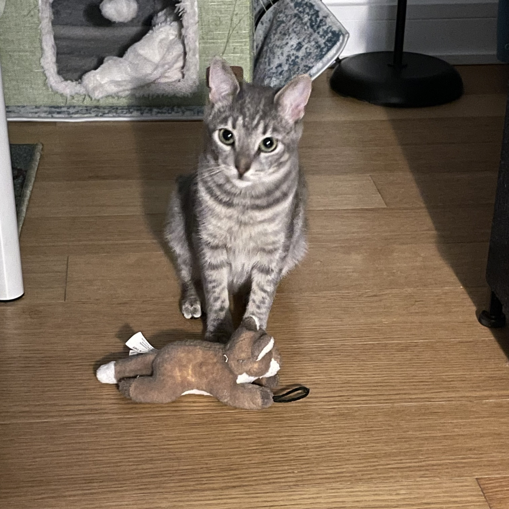

This is the personal website of Samantha Han.

She is currently a student @ [Columbia University](https://www.publichealth.columbia.edu/). 

---

## She Loves Psychology

You can find out more about her academic and professional experience [here](resume.html).

---

## She Loves Cat

Here are some pictures of her cats.

{width=60%}

{width=60%}

---

## She Makes Plots

Look at some [plots](dashboard.html) she made using the [NYC Restaurant Inspection](https://p8105.com/dataset_restaurant_inspections.html) dataset.

The New York City Department of Health and Mental Hygiene conducts restaurant inspections annually, and data on the results are publicly available and are updated daily. The specific data used to for these plots was accessed in October 2017.

Each violation carries a predetermined point value, and the total points are summed at the end of an inspection. The total score is then translated into a letter grade, with lower scores corresponding to higher grades.

